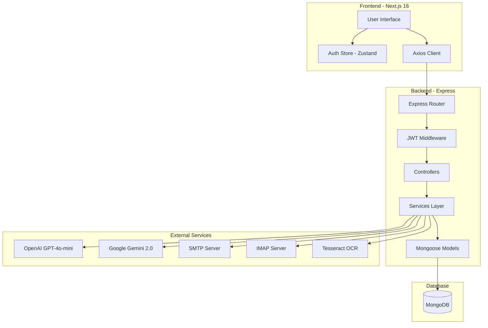

# AI-Powered RFP Management System

A modern, full-stack RFP (Request for Proposal) management platform that leverages artificial intelligence to streamline the procurement process - from creating RFPs using natural language to automatically parsing vendor proposals and generating intelligent comparisons.

[](https://github.com/Pritam-Git01/rfp-management)

## 🎯 Project Overview

This system revolutionizes the traditional RFP process by integrating AI at every step:

- **AI-Powered RFP Creation**: Describe your requirements in plain English, and the system generates structured RFP documents
- **Automated Vendor Communication**: Send RFPs to multiple vendors via email with one click
- **Smart Proposal Parsing**: Automatically extract and structure data from vendor responses (including PDFs and images via OCR). The vendor should reply in the same email from where they received the proposal, **or they can send a direct message with a subject line that starts with `RFP: [refd id]`, such as `RFP: 69318741bt57e0cbf6804a20`**.

Does this capture your full requirement?
- **Intelligent Comparison**: Compare proposals side-by-side with AI-generated recommendations based on price, compliance, and completeness

## 🚀 Key Features

- ✅ **Natural Language Processing**: Create detailed RFPs from conversational descriptions
- 📧 **Email Integration**: Automated outbound (SMTP/Nodemailer) and inbound (IMAP polling) email handling
- 🤖 **Dual AI Providers**: OpenAI GPT-4o-mini primary + Google Gemini 2.0 fallback for reliability
- 📄 **OCR Support**: Extract text from PDF and image attachments using Tesseract.js
- 📊 **Smart Comparisons**: Multi-criteria analysis with AI recommendations
- 🔐 **Secure Authentication**: JWT-based auth with middleware protection
- 🎨 **Modern UI**: Beautiful, responsive interface built with Next.js 16 and ShadCN UI
- 🐳 **Docker Ready**: Multi-stage Dockerfiles and docker-compose for easy deployment

## 🛠️ Tech Stack

### Frontend

| Technology | Version | Why We Chose It |
|------------|---------|-----------------|
| **Next.js** | 16.0.6 | App Router for better performance, Server Components, excellent SEO, and built-in optimizations |
| **TypeScript** | 5.x | Type safety reduces bugs, improves developer experience, better IDE support, and easier refactoring |
| **React** | 19.2.0 | Latest features including improved concurrent rendering and automatic batching |
| **Tailwind CSS** | 4.x | Utility-first CSS for rapid UI development, consistent design system, and smaller bundle sizes |
| **ShadCN UI** | Latest | High-quality, accessible components built on Radix UI, fully customizable, copy-paste friendly |
| **Zustand** | 5.0.9 | Lightweight state management (~1KB), simpler than Redux, no boilerplate, perfect for auth state |
| **React Hook Form + Zod** | Latest | Performant forms with minimal re-renders, type-safe validation, great DX |
| **Axios** | 1.13.2 | Interceptors for automatic token injection, better error handling than fetch |

### Backend

| Technology | Version | Why We Chose It |
|------------|---------|-----------------|
| **Node.js + Express** | Latest | JavaScript ecosystem consistency with frontend, vast npm ecosystem, excellent for I/O operations |
| **MongoDB** | 8.x | Flexible schema perfect for dynamic RFP data structures, easy to scale, JSON-like documents |
| **OpenAI GPT-4o-mini** | Latest | High accuracy for NLP tasks, cost-effective, excellent structured output |
| **Google Gemini 2.0** | Latest | Fallback provider for reliability, competitive pricing, good performance |
| **SMTP + Nodemailer** | Latest | Polling-based vendor response collection, works with any email provider |
| **Tesseract.js** | 5.1.1 | Client-side OCR for extracting text from images and PDFs |
| **JWT** | 9.0.2 | Stateless authentication, scalable, works well with microservices |

### DevOps

| Technology | Why We Chose It |
|------------|-----------------|
| **Docker** | Consistent environments across dev/prod, easy deployment, isolation |
| **Multi-stage Builds** | Smaller image sizes, better security, faster deployments |
| **docker-compose** | Simple orchestration for local development and small deployments |

## 🏗️ Architecture



## 📁 Project Structure

```
rfp-management/
├── frontend/                    # Next.js 16 Frontend
│   ├── src/
│   │   ├── app/
│   │   │   ├── (auth)/         # Auth pages (login, signup)
│   │   │   ├── dashboard/      # Protected dashboard routes
│   │   │   │   ├── page.tsx    # Dashboard home
│   │   │   │   ├── rfps/       # RFP management
│   │   │   │   │   ├── create/ # AI-powered RFP creation
│   │   │   │   │   └── [id]/   # RFP details & comparison
│   │   │   │   └── vendors/    # Vendor management
│   │   │   └── layout.tsx      # Root layout
│   │   ├── components/
│   │   │   ├── layout/         # Sidebar, header
│   │   │   └── ui/             # ShadCN components
│   │   ├── lib/
│   │   │   ├── axios.ts        # Axios instance with interceptors
│   │   │   └── utils.ts        # Utility functions
│   │   ├── store/
│   │   │   └── authStore.ts    # Zustand auth state
│   │   └── types/              # TypeScript types
│   ├── Dockerfile              # Multi-stage Docker build
│   ├── package.json
│   └── README.md
│
├── backend/                     # Express Backend
│   ├── src/
│   │   ├── config/
│   │   │   └── database.js     # MongoDB connection
│   │   ├── models/
│   │   │   ├── User.js         # User schema
│   │   │   ├── RFP.js          # RFP schema
│   │   │   ├── Vendor.js       # Vendor schema
│   │   │   └── Proposal.js     # Proposal schema
│   │   ├── middleware/
│   │   │   ├── auth.js         # JWT verification
│   │   │   └── errorHandler.js # Global error handler
│   │   ├── services/
│   │   │   ├── aiService.js    # OpenAI/Gemini integration
│   │   │   ├── emailService.js # SMTP/IMAP handling
│   │   │   ├── ocrService.js   # Tesseract OCR
│   │   │   └── comparisonService.js # Proposal comparison
│   │   ├── controllers/
│   │   │   ├── authController.js
│   │   │   ├── rfpController.js
│   │   │   ├── vendorController.js
│   │   │   └── proposalController.js
│   │   ├── routes/
│   │   │   ├── auth.js
│   │   │   ├── rfp.js
│   │   │   ├── vendor.js
│   │   │   └── proposal.js
│   │   ├── scripts/
│   │   │   ├── seedVendors.js  # Seed database
│   │   │   └── pollEmails.js   # Email polling service
│   │   └── app.js              # Express app
│   ├── Dockerfile              # Multi-stage Docker build
│   ├── package.json
│   └── README.md
│
├── docker-compose.yml           # Docker orchestration
└── README.md                    # This file
```

## 🚀 Getting Started

### Prerequisites

#### For Docker Setup (Recommended)
- Docker >= 20.x
- Docker Compose >= 2.x

#### For Local Development
- Node.js >= 18.x
- npm or yarn
- MongoDB >= 6.x
- OpenAI API Key
- Google Gemini API Key (optional)
- Gmail account with App Password (for SMTP and IMAP)

### Setup Option 1: Docker (Recommended for Production)

**1. Clone the Repository**
```bash
git clone https://github.com/Pritam-Git01/rfp-management.git
cd rfp-management
```

**2. Configure Environment Variables**

Create `.env` files in both `frontend/` and `backend/` directories:

```bash
# Backend: backend/.env
cp backend/.env.example backend/.env
```

Edit `backend/.env`:
```env
PORT=5000
NODE_ENV=production

MONGODB_URI=mongodb://mongo:27017/rfp_management

JWT_SECRET=your_secure_random_string
JWT_EXPIRES_IN=7d

OPENAI_API_KEY=your_openai_api_key_here
GEMINI_API_KEY=your_gemini_api_key_here

SEND_FROM_EMAIL=your_email@domain.com
SEND_FROM_NAME=RFP Management System

SMTP_HOST=smtp.gmail.com
SMTP_PORT=465
SMTP_USER=your_email@gmail.com
SMTP_PASS=your_app_password_here

EMAIL_POLL_INTERVAL=2
```

```bash
# Frontend: frontend/.env
cp frontend/.env.example frontend/.env
```

Edit `frontend/.env`:
```env
NEXT_PUBLIC_API_URL=http://localhost:5000/api
```

**3. Build and Run with Docker Compose**
```bash
docker-compose up --build
```

**4. Access the Application**
- Frontend: http://localhost:3000
- Backend API: http://localhost:5000/api

**5. Seed Vendor Data** (First time only)
```bash
docker-compose exec backend npm run seed
```

To stop the containers:
```bash
docker-compose down
```

### Setup Option 2: Local Development

**1. Clone the Repository**
```bash
git clone https://github.com/Pritam-Git01/rfp-management.git
cd rfp-management
```

**2. Setup Backend**

```bash
cd backend

# Install dependencies
npm install

# Configure environment
cp .env.example .env
# Edit .env with your credentials (see above)

# Ensure MongoDB is running locally
# For Ubuntu/Debian:
sudo systemctl start mongod

# Seed vendor data
npm run seed

# Start backend server
npm run dev
```

Backend will run on http://localhost:5000

**3. Setup Frontend** (in a new terminal)

```bash
cd frontend

# Install dependencies
npm install

# Configure environment
cp .env.example .env
# Edit .env:
# NEXT_PUBLIC_API_URL=http://localhost:5000/api

# Start development server
npm run dev
```

Frontend will run on http://localhost:3000

**4. Start Email Polling** (optional, in a new terminal)

```bash
cd backend
npm run email:poll
```

## 📚 API Endpoints

### Authentication
- `POST /api/auth/signup` - Create new user account
- `POST /api/auth/login` - Login and get JWT token
- `GET /api/auth/profile` - Get current user profile (protected)

### RFP Management
- `GET /api/rfps` - Get all RFPs (protected)
- `POST /api/rfps` - Create RFP from natural language (protected)
- `GET /api/rfps/:id` - Get RFP details (protected)
- `PATCH /api/rfps/:id` - Update RFP (protected)
- `DELETE /api/rfps/:id` - Delete RFP (protected)
- `POST /api/rfps/:id/send` - Send RFP to vendors via email (protected)

### Vendor Management
- `GET /api/vendors` - Get all vendors (protected)
- `GET /api/vendors?category=laptops` - Filter by category (protected)
- `GET /api/vendors/:id` - Get vendor details (protected)

### Proposal Management
- `GET /api/proposals/rfp/:rfpId` - Get all proposals for an RFP (protected)
- `GET /api/proposals/:id` - Get proposal details (protected)
- `GET /api/proposals/rfp/:rfpId/compare` - AI-powered comparison (protected)

For detailed API documentation with request/response examples, see:
- [Backend API Docs](backend/README.md#api-documentation)

## 🔑 Environment Variables

### Backend

| Variable | Description | Required |
|----------|-------------|----------|
| `PORT` | Backend server port | Yes |
| `NODE_ENV` | Environment (development/production) | Yes |
| `MONGODB_URI` | MongoDB connection string | Yes |
| `JWT_SECRET` | Secret for JWT signing | Yes |
| `JWT_EXPIRES_IN` | Token expiration time | Yes |
| `OPENAI_API_KEY` | OpenAI API key | Yes |
| `GEMINI_API_KEY` | Google Gemini API key | No (fallback) |
| `SEND_FROM_EMAIL` | Sender email address | Yes |
| `SEND_FROM_NAME` | Sender display name | Yes |
| `SMTP_HOST` | SMTP server hostname (e.g., smtp.gmail.com) | Yes |
| `SMTP_PORT` | SMTP server port (465 for SSL, 587 for TLS) | Yes |
| `SMTP_USER` | SMTP username (email) | Yes |
| `SMTP_PASS` | SMTP password (app password for Gmail) | Yes |
| `EMAIL_POLL_INTERVAL` | Email polling interval in minutes | Yes |

### Frontend

| Variable | Description | Required |
|----------|-------------|----------|
| `NEXT_PUBLIC_API_URL` | Backend API URL | Yes |

**Note**: Variables prefixed with `NEXT_PUBLIC_` are exposed to the browser.

## 🎨 User Flow

### 1. Authentication
```
Landing Page → Login/Signup → Dashboard
```

### 2. Create RFP with AI
```
Dashboard → Create RFP → Describe in Natural Language → 
AI Processes → Review Structured Data → Edit (Optional) → Save
```

### 3. Send RFP to Vendors
```
RFP Details → Select Vendors → Send → Email Sent to All Selected Vendors
```

### 4. Receive and Parse Proposals
```
Vendor Replies via Email → IMAP Polling Detects (2-minute intervals) → AI Parses → 
Extracted Data Saved → Available in Proposals Tab
```

### 5. Compare Proposals with AI
```
RFP Details → Compare Button → AI Analyzes All Proposals → 
Shows Recommendations, Summary Stats, Side-by-Side Comparison
```

## 🧪 Development

### Frontend Development

```bash
cd frontend

# Run dev server with hot reload
npm run dev

# Build for production
npm run build

# Start production server
npm start

# Lint code
npm run lint
```

### Backend Development

```bash
cd backend

# Run with auto-restart
npm run dev

# Run production
npm start

# Seed vendors
npm run seed

# Start email polling
npm run email:poll
```

### Coding Standards

- **Frontend**: TypeScript strict mode, ESLint with Next.js config
- **Backend**: ES6+ JavaScript, consistent error handling
- **Components**: Function-based components, clear prop types
- **Styling**: Tailwind utilities, ShadCN component variants
- **State**: Zustand for global state, React state for local
- **API Calls**: Centralized axios instance with interceptors

## 🤝 Contributing

1. Fork the repository
2. Create a feature branch (`git checkout -b feature/amazing-feature`)
3. Follow the existing code style
4. Test your changes thoroughly
5. Commit your changes (`git commit -m 'Add amazing feature'`)
6. Push to the branch (`git push origin feature/amazing-feature`)
7. Open a Pull Request

## 📝 Key Design Decisions

### 1. Dual AI Provider Strategy
- **Primary**: OpenAI GPT-4o-mini for highest accuracy in NLP tasks
- **Fallback**: Google Gemini 2.0 for reliability and cost optimization
- Function-based abstraction makes it easy to switch providers

### 2. Email-Based Workflow
- **Outbound**: SMTP with Nodemailer for reliable email delivery
- **Inbound**: IMAP polling (2-minute intervals) for vendor responses
- Subject line matching to associate responses with RFPs
- Works with any email provider (Gmail, Outlook, etc.)

### 3. OCR Pipeline
- PDF text extraction with pdf-parse
- Image OCR with Tesseract.js
- AI parsing of extracted text into structured data

### 4. Authentication Architecture
- JWT tokens (7-day expiration)
- Middleware-based route protection (Next.js middleware)
- Encrypted localStorage cache for performance
- Automatic token refresh on API calls

### 5. Serverless-Ready Frontend
- Next.js 16 with standalone output
- Optimized for Vercel deployment
- Static generation where possible
- API routes for server-side operations

## 🔮 Future Enhancements

- [ ] Real-time email webhooks (replace IMAP polling)
- [ ] Redis caching for improved performance
- [ ] S3/Cloud storage for file uploads
- [ ] Multi-user support with role-based access control
- [ ] Advanced vendor management UI
- [ ] Email tracking (opens, clicks)
- [ ] Proposal versioning and audit logs
- [ ] Dark mode support
- [ ] Internationalization (i18n)
- [ ] E2E testing with Playwright
- [ ] Kubernetes deployment manifests

## 🐛 Troubleshooting

### MongoDB Connection Issues
```bash
# Check if MongoDB is running
mongosh

# Start MongoDB (Ubuntu/Debian)
sudo systemctl start mongod

# Check MongoDB status
sudo systemctl status mongod
```

### Email Not Sending
- Verify SMTP credentials (host, port, user, password)
- For Gmail, ensure "App Passwords" is enabled (not your regular password)
- Check SMTP_PORT: use 465 for SSL or 587 for TLS
- Verify SEND_FROM_EMAIL is valid

### Email Polling Not Working
- Confirm IMAP credentials are correct (use same credentials as SMTP)
- Enable "App Passwords" for Gmail (not your regular password)
- Check firewall allows port 993 (IMAP) and 465/587 (SMTP)
- Verify EMAIL_POLL_INTERVAL is set correctly (default: 2 minutes)
- Review polling logs: `npm run email:poll`

### AI Parsing Errors
- Check OpenAI API key and billing status
- Verify rate limits haven't been exceeded
- Check Gemini API key (fallback)
- Review API usage in provider dashboards

### Docker Issues
```bash
# Clean rebuild
docker-compose down -v
docker-compose build --no-cache
docker-compose up

# View logs
docker-compose logs -f backend
docker-compose logs -f frontend
```

## 📄 License

MIT License - feel free to use this project for learning or commercial purposes.

## 🙏 Acknowledgments

- OpenAI for GPT-4 API
- Google for Gemini API
- Vercel for Next.js framework
- ShadCN for beautiful UI components
- The open-source community

## 📞 Support

For issues, questions, or contributions:
- **GitHub Issues**: [Create an issue](https://github.com/Pritam-Git01/rfp-management/issues)
- **Documentation**: See [Frontend README](frontend/README.md) and [Backend README](backend/README.md) for detailed docs

---

**Built with ❤️ using Next.js, Express, and AI**
